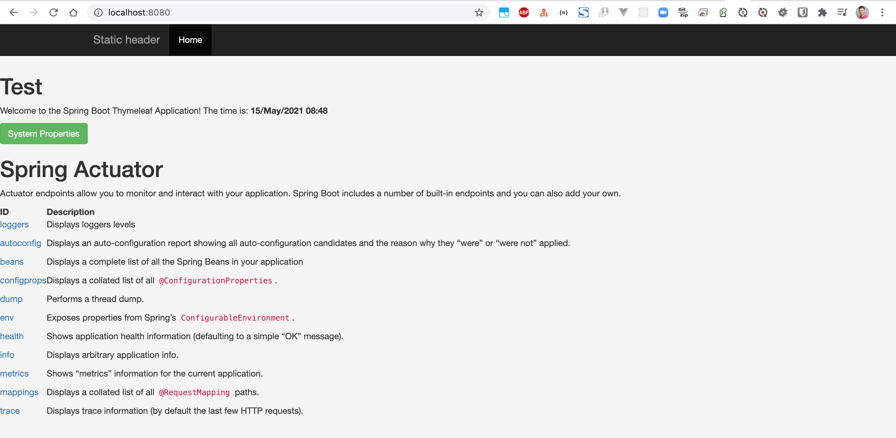
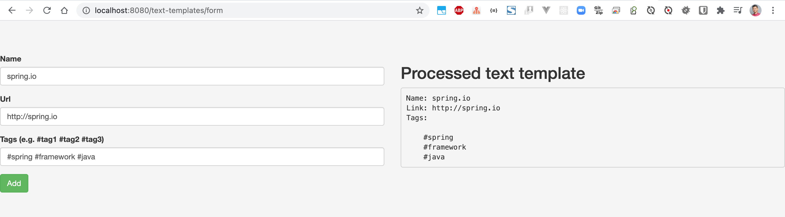
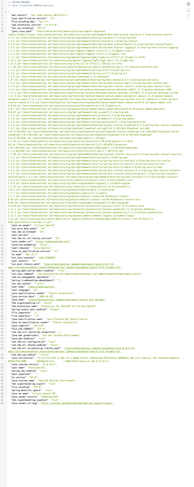

# springboot-thymeleaf-sample

### Things todo list:

1. Clone this repository: `git clone https://github.com/hendisantika/springboot-thymeleaf-sample.git`
2. Navigate to the folder: `cd springboot-thymeleaf-sample`
3. Run the application: `mvn clean spring-boot:run`
4. Use these credentials: `admin/admin` & `user/user`
5. Open your favorite browser: http://localhost:8080

### Images Screen shot

Home Page

Form Page

Properties Page

